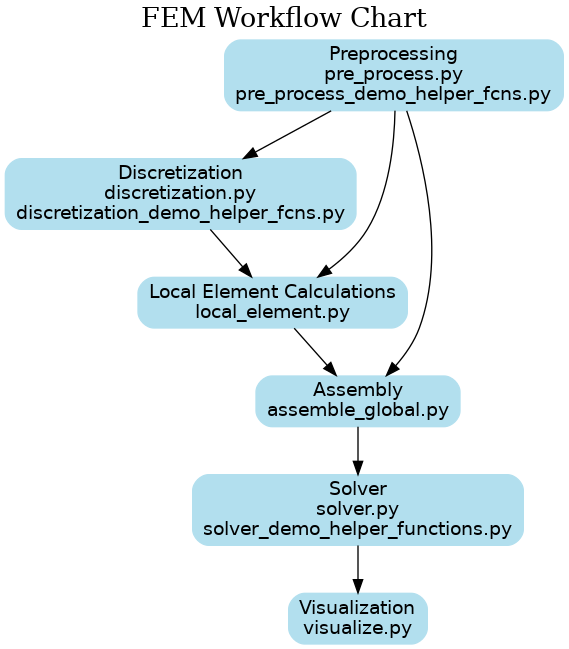
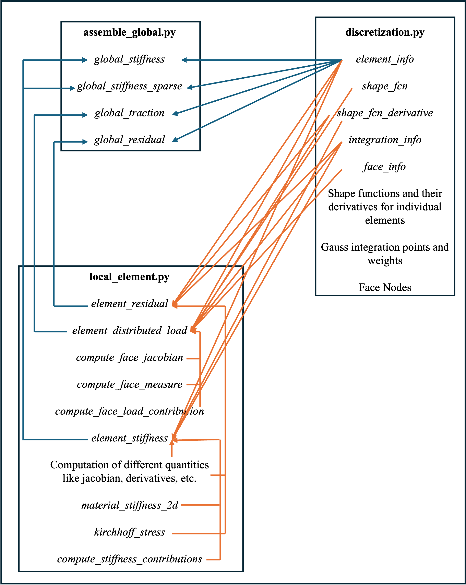

# Finite Element Method (FEM) Framework

This repository contains a quick overview of a [Finite Element Method (FEM) solver](https://github.com/Lejeune-Lab-Graduate-Course-Materials/finite-element-analysis/), structured for clarity, extensibility, and pedagogical use. The workflow follows the standard FEM pipeline: preprocessing → discretization → element calculations → assembly → solving → visualization.

---

## Directory Structure & Module Responsibilities

### `pre_process.py`, `pre_process_demo_helper_fcns.py`
- Defines the mesh, geometry, material properties, and boundary conditions.
- Outputs: connectivity matrix, material dictionary, and boundary condition mappings.

### `discretization.py`, `discretization_demo_helper_fcns.py`
- Provides element type information, shape functions, derivatives, and numerical integration (e.g. Gauss quadrature).
- Supports generic handling of various element types.

### `local_element.py`
- Computes local stiffness matrices and force vectors based on element shape functions and material laws.

### `assemble_global.py`
- Assembles global stiffness matrix and load vector from local contributions using connectivity and DOF maps.

### `solver.py`, `solver_demo_helper_functions.py`
- Applies boundary conditions.
- Solves the global system of equations.
- Computes post-processing quantities like stress/strain.

### `visualize.py`
- Plots deformed configurations, field variables, and supports potential extensions like animation or exporting to VTK.

---

## Workflow Overview

1. **Preprocessing**: Define mesh, materials, and BCs.
2. **Discretization**: Get shape functions and integration rules.
3. **Local Computation**: Calculate element-level contributions.
4. **Assembly**: Build global system.
5. **Solving**: Apply BCs and solve.
6. **Visualization**: Display results.

## High Level Overview
### Brief description of workflow


### Overview of the backend processes
This section demonstrates the functioning of FEM solver at the backend level (ommiting the functioning and usage of helper functions which are discussed in the later sections.)


## Following an Entry Point
full_code_example_1.py was taken as the entry point.

Code starts with importing required libraries.

"D2_nn6_tri" element was chosed with 2 degrees of freedom.

Dimensions of domain, mesh and a stretch (lambda_target) were prescribed.
```python
# FEA problem info
ele_type = "D2_nn6_tri"
ndof = 2

# Define domain
L = 10.0      # length in x-direction
H = 5.0       # height in y-direction
nx = 4       # number of elements in x
ny = 2       # number of elements in y, keep this an even number if you want the analytical solution to be able to compute midline deformation

# Prescribed stretch (e.g., lambda = 1.05 gives a 5% extension)
lambda_target = 1.05
```
rectangular mesh was generated and coordinates alongwith connections were stored.

```python
coords, connect = pre.generate_rect_mesh_2d(ele_type, 0.0, 0.0, L, H, nx, ny)
```
This calls generate_rect_mesh_2d function from pre_process module. It checks which element type is being used and then returns the mesh for that particular element type by calling another function

```python
return generate_tri6_mesh(x_lower, y_lower, x_upper, y_upper, nx, ny)
```

It uses numpy and other mathematical operations to generate coordinates and connections for the mesh.

Then mesh is generated and an image of the mesh is saved for verification.

```python
mesh_img_fname = tutorials_dir / "full_code_example_1_mesh.png"
pre_demo.plot_mesh_2D(str(mesh_img_fname), ele_type, coords, connect)
```

The plot_mesh_2D function uses matplotlib library to plot the mesh alongwith gauss points.

The boundary nodes and edges are obtained using the identify_rect_boundaries function from pre_process module.

```python
boundary_nodes, boundary_edges = pre.identify_rect_boundaries(coords, connect, ele_type, 0, L, 0, H)
```

identify_rect_boundaries uses another inbuilt function local_faces_for_element_type to identify the boundaries and edges of the domain.

Then boundary conditions are assigned as per the requirement using the function assign_fixed_nodes_rect from pre_process module. This includes fixed boundaries, partially fixed boundaries and displacement boundary conditions.
```python
# 1. Fix left boundary: both u_x and u_y = 0.
fixed_left = pre.assign_fixed_nodes_rect(boundary_nodes, "left", 0.0, 0.0)
# 2. Prescribe right boundary: u_x = (lambda_target - 1)*L at x = L.
fixed_right = pre.assign_fixed_nodes_rect(boundary_nodes, "right", (lambda_target - 1) * L, 0)
# 3. To force a homogeneous state, prescribe u_y = 0 on the top and bottom boundaries.
fixed_top_y = pre.assign_fixed_nodes_rect(boundary_nodes, "top", None, 0.0)
fixed_bottom_y = pre.assign_fixed_nodes_rect(boundary_nodes, "bottom", None, 0.0)
# Combine BCs (assuming the functions return arrays of shape (3, n_bc))
fixed_nodes = np.hstack((fixed_left, fixed_right, fixed_top_y, fixed_bottom_y))
```

After assigning the material properties and other required parameters hyperelastic_solver is called from solver module to study the problem.

```python
displacements_all, nr_info_all = hyperelastic_solver(
    material_props,
    ele_type,
    coords.T,      # solver expects coords as (ncoord, n_nodes)
    connect.T,     # and connectivity as (n_nodes_per_elem, n_elems)
    fixed_nodes,
    dload_info,
    nr_print=True,
    nr_num_steps=nr_num_steps,
    nr_tol=1e-8,
    nr_maxit=30,
)
```
The hyperelastic_solver uses element_info function from discretization module to get the information of degrees of freedom.

Then solver uses the for loop to apply load incrementally. In this loop, iterations are performed until tolerance is achieved. It calls the global_stiffness, global_traction and global_residual functions from assemble_global module to calculate the required quantities. The functioning of these functions can be understood from the previous section.

Post processing is done and results are compared with the analytical values.
